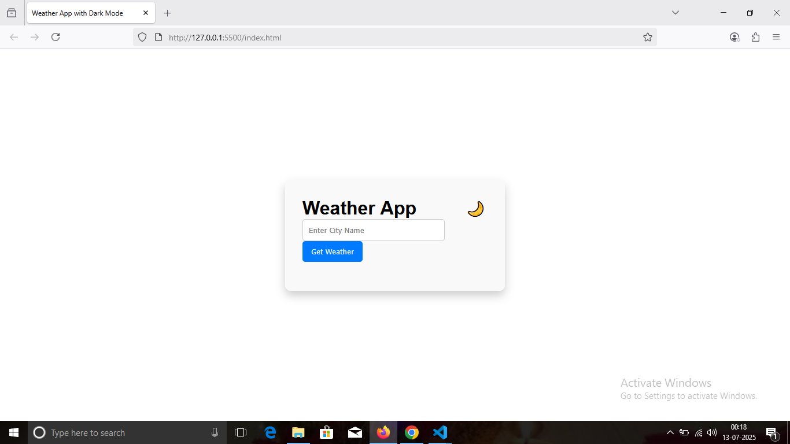
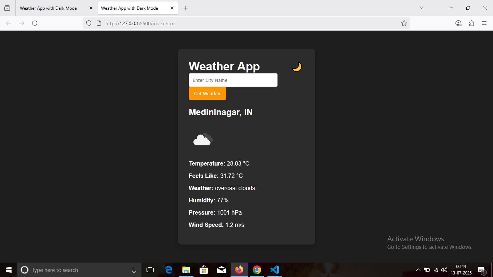

# 🌦️ Weather Application

A responsive and dynamic weather web application that provides real-time weather information for any city using the **OpenWeatherMap API**. Built using **HTML**, **CSS**, and **JavaScript**, it offers a clean UI with dark mode support and live weather data including temperature, humidity, wind, and more.

---

## 📖 Project Overview

The **Weather Application** is a lightweight, fast, and interactive web tool that allows users to search any city and view up-to-date weather conditions. It demonstrates how to integrate and consume a public API with JavaScript while maintaining good UI/UX practices.

Users can:
- 🌍 Search by city name
- 🌡️ View temperature & “feels like” temp
- 🌫️ See live weather conditions with icons
- 💧 Check humidity, pressure, wind speed
- 🌙 Toggle dark/light mode
- ✅ Use on desktop or mobile devices (fully responsive)

---

## 📸 Screenshots

### 🔹 Home Page  


### 🔹 Weather Results  


---

## 💻 Technologies Used

| Technology         | Description                                                                 |
|--------------------|-----------------------------------------------------------------------------|
| **HTML5**           | Provides the basic structure and layout of the web application.             |
| **CSS3**            | Adds styling, responsive design, and dark mode support.                     |
| **JavaScript (ES6)**| Handles user input, API requests, and DOM manipulation.                     |
| **OpenWeatherMap API** | Supplies real-time weather data including conditions, temp, wind, etc. |

---

## 🛠️ How to Use

1. **Clone this repository**  
   ```bash
   git clone https://github.com/your-username/weather-app.git
   cd weather-app
   ```

2. **Insert your OpenWeatherMap API Key**  
   Open `script.js` and replace:
   ```js
   const apiKey = 'YOUR_API_KEY';
   ```

3. **Run the App**  
   - Open `index.html` directly in a browser  
   - Or use **Live Server** extension in VS Code

---

## 🌐 API Used

- **OpenWeatherMap API**  
  [https://openweathermap.org/api](https://openweathermap.org/api)

---

## 👩‍💻 Intern Details

- **Company**: CODTECH IT SOLUTIONS  
- **Intern Name**: NEHA SHUKLA  
- **Intern ID**: CT06DF671  
- **Domain**: MERN STACK WEB DEVELOPMENT  
- **Duration**: 6 WEEKS  
- **Mentor**: NEELA SANTOSH KUMAR

---

## 👩‍💻 Developer

**Neha Shukla**  
[GitHub Profile](https://github.com/your-username)

---

## 📜 License

This project is licensed under the **MIT License**.  
Feel free to use and modify it for learning purposes.
